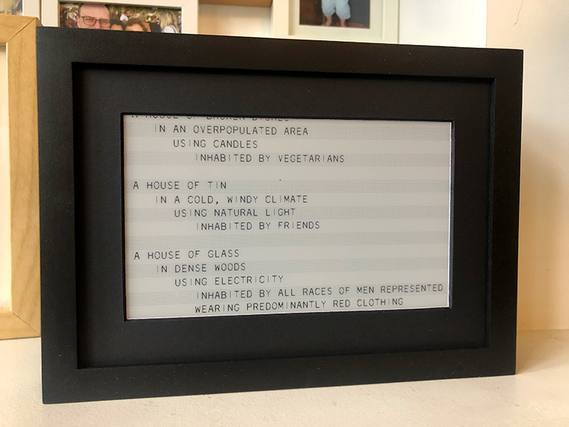

# House of Dust  

This script is a loose recreation of Alison Knowles early computer-generated poem [A House of Dust](https://zkm.de/en/artwork/house-of-dust)  

The code is based on [Nick Monfort's recreation](https://nickm.com/memslam/) that was created for & presented at the first NYU ITP Code Poetry Slam in 2014. 

If you want to learn more about early computer art, I highly recommend this book: [Mainframe Experimentalism by Hannah Higgins & Douglas Kahn](https://www.ucpress.edu/book/9780520268388/mainframe-experimentalism), text also available at [monoksop](https://monoskop.org/log/?p=19231)

 

 
